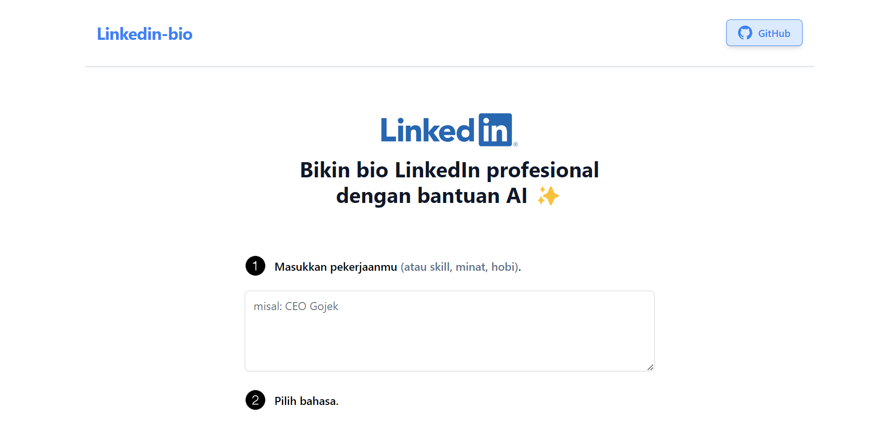

# [linkedin-bio](https://bikin-linkedin-bio.vercel.app)

Transform your LinkedIn presence in seconds with our AI-powered professional bio generator.

[](https://bikin-linkedin-bio.vercel.app)

## How it Works

This application uses the Groq AI API to generate a customized LinkedIn bio. The process is simple:

1. The user provides input through a form.
2. The application constructs a prompt using the provided details.
3. The prompt is sent to the Groq AI API.
4. The API streams the response back to the application, resulting in a tailored LinkedIn bio.

## Getting Started

### Prerequisites

- Node.js installed on your machine.
- A Groq AI API key.

### Installation

1. Clone this repository:
   ```bash
   git clone https://github.com/irfan-za/linkedin-bio.git
   ```
2. Navigate into the project directory:
   ```bash
   cd linkedin-bio
   ```
3. Install the dependencies:
   ```bash
   npm install
   ```

### Running the Application

1. Create a `.env` file in the root directory and add your Groq AI API key:
   ```plaintext
   GROQ_API_KEY=your_groq_ai_api_key_here
   ```
2. Start the development server:
   ```bash
   npm run dev
   ```
3. Open your browser and go to `http://localhost:3000` to see the application in action.

## Resources

- [Groq AI API Documentation](https://groq.com/)
